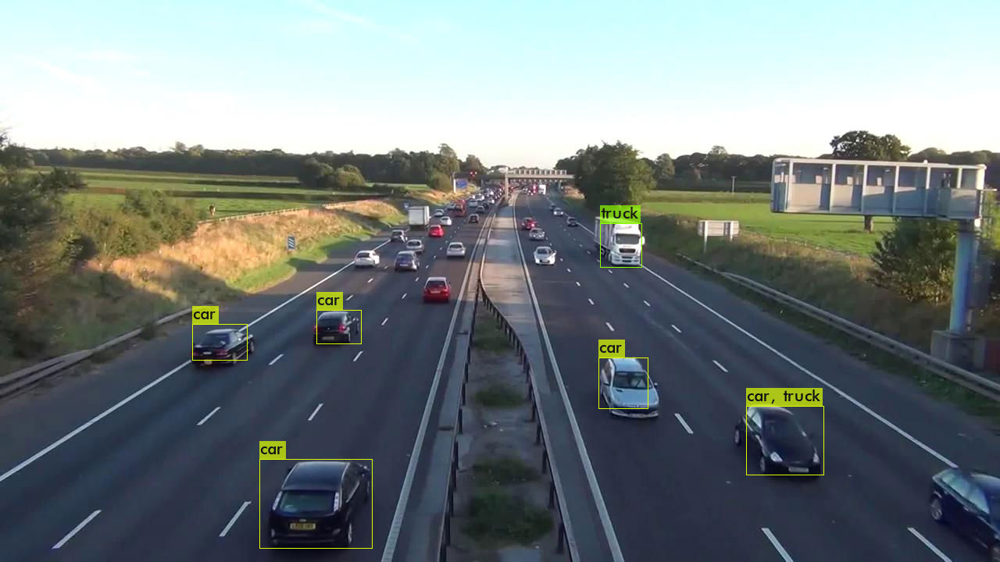

> 最近机缘巧合下接触到智慧零售，于是了解到一些基于摄像头的流量（人/车）监控方案。其基本思路，基本都是通过SSD或者YOLO识别具体人物，然后计算帧与帧中物体经过gate的个数... 所以第一步先来搞定物体识别。

先附上colab notebook，不想看介绍的可以直接看演示：

* YOLOv3-tiny: https://colab.research.google.com/drive/1XSArXZImsYsorzcv4vX3aN5TQaLkKmPx?usp=sharing
* YOLOv4`训练较慢，GPU大概要半小时才100次迭代`: https://colab.research.google.com/drive/1XIpuhhTlVvYIDzenZxdWKl-tk7lwbL-2?usp=sharing

## 1. [AlexeyAB/darknet](https://github.com/AlexeyAB/darknet)

看了下，darknet应该是目前最好上手的项目，编译就是个bin文件，加载模型和`training`(fine-tune)都是用这个工具完成。因为要用到最新的 YOLOv4，所以选alexeyab的版本。

### 1.1 编译 (make darknet)

```bash
# clone 并编译darknet
!test -d darknet || git clone https://github.com/AlexeyAB/darknet
%cd darknet
!make -j8
```

### 1.2 预测 (detect)

先下载预训练的权重：yolov3-tiny-prn.weights，放在当前目录下

```bash
# 准备预测用图片，这里我们用一张高速的照片
!wget https://github.com/nathanrooy/rpi-urban-mobility-tracker/raw/master/notebooks/highway02_frame000010.jpg

# 预测
!./darknet detect cfg/yolov3-tiny-prn.cfg yolov3-tiny-prn.weights highway02_frame000010.jpg -dont_show
```

结束后会在当前目录，生成一个`predictions.jpg`，即是标注结果。我们用PIL输出，即可看到标注情况：

```py
from PIL import Image

Image.open('predictions.jpg')
```



> YOLOv4标注的更多，连远处的车和广告牌都标出来了（虽然识别成了火车，不过看起来确实有点像）

## 2. 自定义物体识别 (whill dataset)

为了识别自定义的物体，我们自然要找个没见过的东西和并标注。这里为了简便，我们用[KazumichiShirai](https://github.com/KazumichiShirai/darknet/tree/master/data/whill)提供的数据集，100来张自动轮椅的图片进行目标识别。

效果如下：


原版是用 [darknet53训练](https://github.com/KazumichiShirai/yolo-detect-custom-objects/blob/master/whill_model_c_yolo.ipynb) 的，这里我们改成用YOLO的预训练权重。

为简便起见，我已经打包好了这些图片和YOLOv4的训练参数配置。注意不是下载到本地，直接转储到Google Drive的 `datastes/whill/` 下备用：

https://drive.google.com/drive/folders/1A6ogns-_aJee3mItRykMy_ZtqzsyOeZu?usp=sharing

### 2.1 darknet training 环境准备

首先参考方法1编译darknet，但训练必须使用GPU，因此我们需要先改下`Makefile`（最开始就是卡这里，默认非GPU的darknet，到train步骤就报错）。主要变动是头部的几个参数(如果GPU够好，`CUDNN_HALF`可按实际情况打开)：

```makefile
GPU=1
CUDNN=1
CUDNN_HALF=0
OPENCV=1
```

这里推荐直接用上面提供的数据，其中已经包含了Makefile，我们直接cp过来（注意先要[mount gdrive](http://blog.imaou.com/Colab_tricks/?#2-%E8%AE%BF%E9%97%AE-google-drive-%E4%B8%8A%E7%9A%84%E6%95%B0%E6%8D%AE)）

```bash
# 准备GPU的 darknet 编译文件
!cp -fv "/gdrive/My Drive/datasets/whill/Makefile" Makefile
!make -j8
```

编译成功后，我们将生成的 darknet 复制到 `build/darknet/x64/` 下，并参考[官方教程](https://github.com/AlexeyAB/darknet#how-to-train-to-detect-your-custom-objects)准备whill的配置与数据文件（建议开始仔细看看官方教程的这段，里面对怎么修改参数介绍得很清楚）：

```bash
!cp -fv darknet ./build/darknet/x64/
%cd ./build/darknet/x64/

# 配置与权重，yolov3-tiny.conv.11 可以提前转储到gdrive下，然后像这样cp过来（比直接wget快很多）
!test -f yolov3-tiny_whill.cfg || cp -fv "/gdrive/My Drive/datasets/whill/yolov3-tiny_whill.cfg" .
!test -f yolov3-tiny.conv.11 || cp -v "/gdrive/My Drive/datasets/models/yolov3-tiny.conv.11" .

# whill的数据文件
!test -f data/whill.names || cp -fv "/gdrive/My Drive/datasets/whill/whill.names" data/
!test -f data/whill.data || cp -fv "/gdrive/My Drive/datasets/whill/whill.data" data/
!test -f data/whill_train.txt || cp -fv "/gdrive/My Drive/datasets/whill/train.txt" data/whill_train.txt
!test -f data/whill_test.txt || cp -fv "/gdrive/My Drive/datasets/whill/test.txt" data/whill_test.txt
```

### 2.2 training

以下以 YOLOv3-tiny 为例：

```bash
# 第一次从 yolov3-tiny.conv.11 开始训练
!./darknet detector \
      train -dont_show \
      data/whill.data \
      yolov3-tiny_whill.cfg \
      yolov3-tiny.conv.11
```

100轮后会在 backup/yolov3-tiny_whill_last.weights 生成备份。之后可以用这个接着训练，因此每次colab跑完，记得将之cp回gdrive：

比如: `!cp -fv "backup/yolov3-tiny_whill_last.weights" "/gdrive/My Drive/datasets/whill/"`

```bash
# 接着上次的位置开始训练
!./darknet detector \
      train -dont_show \
      data/whill.data \
      yolov3-tiny_whill.cfg \
      backup/yolov3-tiny_whill_last.weights
```

常见问题是启动后报 `Out of memory`，查了下是 `subdivisions` 太小导致(官方文档也有说明)，参考下面方法把`16`改大到`32或64`即可：

```bash
!cat yolov3-tiny_whill.cfg | grep subdivisions

# 增加 subdivisions 避免 Out of memory
!sed -i "s/subdivisions=16/subdivisions=32/" yolov3-tiny_whill.cfg
```

每100轮还会输出一个图片，包含lost的情况，能够比较方便的判断目前进度如何。

### 2.3 detect

对训练好的weights，运行如下test命令即可进行预测。输出结果见`predictions.jpg`

```bash
!./darknet detector \
      test -dont_show \
      data/whill.data \
      yolov3-tiny_whill.cfg \
      backup/yolov3-tiny_whill_last.weights \
      data/whill/000126.jpg
```

如果没有输出，请将`yolov3-tiny_whill.cfg`里的`batch`和`subdivisions`都改成`1`：

```bash
!sed -i "s/batch=64/batch=1/" yolov3-tiny_whill.cfg
!sed -i "s/subdivisions=16/subdivisions=1/" yolov3-tiny_whill.cfg
```
