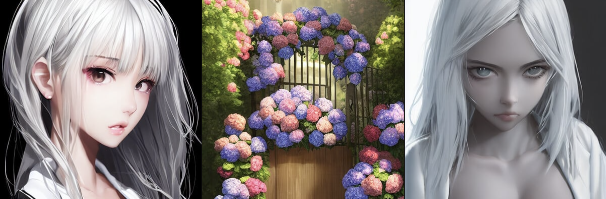
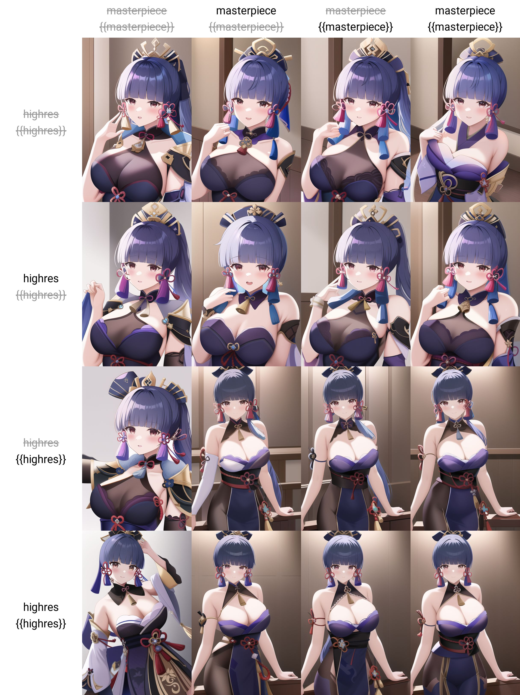
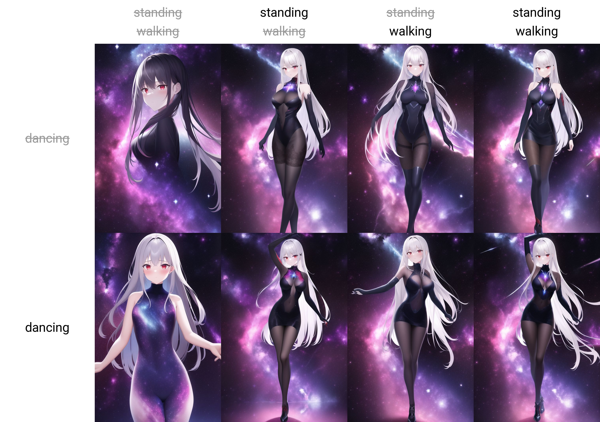

## 前言

> Stable Diffusion确实可玩性很高，十一玩了很久的 Waifu Diffusion，还开了个[ArtStation账号](https://upbit.artstation.com/)记录生成作品的Prompt和Seeds，方便回顾生成得不错的作品。
> 
> 
> 
> 这里记录下一些调整过程中的技巧，方便以后查询
> 
> 不过 [hakurei/waifu-diffusion](https://huggingface.co/hakurei/waifu-diffusion) 更新到v1.3后，感触是同样seed下1.3风格有点过度，而且`full body`描述容易出现没头的情况（v1.2很少遇到）。这两天看到[NovelAI泄漏](https://mirai.mamoe.net/topic/1659/%E6%9C%AC%E5%9C%B0%E6%90%AD%E5%BB%BAnovelai-%E5%85%8D%E8%B4%B9%E7%9A%84%E8%89%B2%E5%9B%BE%E7%94%9F%E6%88%90%E5%99%A8)，又有可以玩的了。

## 相关资料备忘

> 1. 简单易用的SD WebUI，支持 NovelAI。强烈推荐：[AUTOMATIC1111 WebUI](https://github.com/AUTOMATIC1111/stable-diffusion-webui)
> 1. 知乎：NovelAI 魔法术式基础，适合初学者形成概念的好教程：[《参同真解》](https://www.zhihu.com/question/558019952/answer/2710009035)
> 1. NovelAI 正统教程，详尽但很多不是那么好用【NSFW】：[NovelAIのPromptsを収集するWikiです](https://seesaawiki.jp/nai_ch/)
> 1. 国人收集整理的Prompt：[NovelAI 法术书](https://docs.google.com/spreadsheets/d/e/2PACX-1vRa2HjzocajlsPLH1e5QsJumnEShfooDdeHqcAuxjPKBIVVTHbOYWASAQyfmrQhUtoZAKPri2s_tGxx/pubhtml#)
> 1. 早期的指引，从这里学到如何强化某个输入，如何调整角度与画幅：[Waifu Diffusion で効率的に画像を生成する](https://dskjal.com/others/waifu-diffusion-workflow.html)
> 1. 一些相关资料介绍：[話題のお絵かき画像生成AI『Stable Diffusion』の体験・インストール方法・プロンプトのコツ・関連情報のまとめ覚書（Win/Mac/Colab）](https://www.activitv.com/entry/stable-diffusion/)

--------------

# 施法前备忘

NovelAI 设置**Step大于30，CFG Scale设置11-13**

# 1. 基础风格

先描述一下要画的内容，例如 `最好的质量，高分辨率，细节满满的壁纸`，按照《参同真解》解释这叫咒语的语音语调^_^ 在这个基础上增加其他内容，成图率会高很多

> Prompt: best quality, highres, original, extremely detailed wallpaper
> Neg Prompt: lowres, bad anatomy, bad hands, text, error, missing fingers,extra digit, fewer digits, cropped, worstquality, low quality, normal quality, jpegartifacts, signature, watermark, username, blurry, bad feet

## 1.1 关于 `{{masterpiece}}`

还有一些关键词，可以绘制结果的质量，例如 `masterpiece`杰作，增加与减少可以通过Prompt矩阵结果，看到同Seed下的明显差异：

从实验结果可以看到，`{{masterpiece}}` 强调2次（[语法解释](https://github.com/AUTOMATIC1111/stable-diffusion-webui/wiki/Features#attentionemphasis)）后质量确实有提升（无论五官还是衣服）；而另一个 `highres` 作用有限。当然这个结果也有可能因为seed不同而不稳定，对于影响不那么明显的，具体需要同Prompt多尝试2次才能知道确切的作用

## 1.2 关于背景的处理

背景也是可以调整的，如果想生成干净的可以添加 `black background`，这个强度非常好可以解决大多数背景不协调的问题，方便后面抠图叠加：

当然也可以用 `nebula background`, `magazine cover` 这样的描述来一次生成背景，一切看个人喜好。不过这样的后果，有时候会带来一些不那么好的结果。

`nebula background`会一定概率让衣服上也出现星云，除非对衣服有非常明确的描述指向，或者就是想要这种风格：

> best quality, highres, original, extremely detailed wallpaper, 1girl, long sliver hair, iron cross, poker face, red eyes, an extremely delicate and beautiful, nebula background, {{masterpiece}}
> Negative prompt: lowres, bad anatomy, bad hands, text, error, missing fingers,extra digit, fewer digits, cropped, worstquality, low quality, normal quality, jpegartifacts, signature, watermark, username, blurry, bad feet
> Steps: 35, Sampler: Euler a, CFG scale: 11, Seed: 3437716200, Size: 640x960, Model hash: 925997e9, Clip skip: 2

`magazine cover`虽然不会让前景出现变化，但杂志的文字很难定制而且基本不知道在说啥：

> {best quality}, {{masterpiece}}, {highres}, original, extremely detailed wallpaper, 1girl, long sliver hair, styled headband, court corset, poker face, red eyes, {an extremely delicate and beautiful, official art, magazine cover
> Negative prompt: lowres, bad anatomy, bad hands, text, error, missing fingers,extra digit, fewer digits, cropped, worstquality, low quality, normal quality, jpegartifacts, signature, watermark, username, blurry, bad feet
> Steps: 30, Sampler: Euler a, CFG scale: 11, Seed: 2976024332, Size: 512x768, Model hash: 925997e9, Clip skip: 2

## 1.3 动作与全身照

如果你只用前面提到的基础风格，加人物的描述，会看到人物往往只会是上半身（画幅512x768竖图），这时可以通过增加动作描述`standing|walking|dancing` 中的前2个来修正：

可以看到`standing`组的脚最正常，而`walking`可能因为原本走动的就很难画，AI只能还原出一只脚的样子。而`dancing`有点出乎意料，看起来是可以和其他2个动作混合的

从原理上来说，描述脚和裤子的词语也能生成全身照，待实验

## 1.4 画风调整

---------------------

> 未完待续
