ps: 因为用的full模型，如果文中引用图片不适请联系我替换或删除

## 前言

> Stable Diffusion确实可玩性很高，十一玩了很久的 Waifu Diffusion，还开了个[ArtStation账号](https://upbit.artstation.com/)记录生成作品的Prompt和Seeds，方便回顾生成得不错的作品。
> 
> 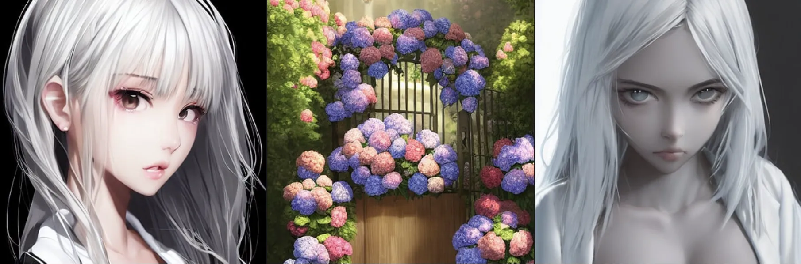
> 
> 这两天看到NovelAI泄漏，对堪称**召唤魔法**的Prompt选择很感兴趣，于是做了些尝试在此记录下，方便日后召唤想要的人物。不过NovelAI因为众所周知的原因，生成的人物画风比较趋同。个人觉得看久了会腻（油腻的意义上...）
> 
> 不过再吐槽一句， [hakurei/waifu-diffusion](https://huggingface.co/hakurei/waifu-diffusion) 更新到v1.3后，同样prompt/seed下1.3风格有点过度，而且`full body`描述容易出现没头的情况（v1.2很少遇到）

## 相关资料备忘

> 1. 简单易用的SD WebUI，支持 NovelAI。强烈推荐：[AUTOMATIC1111 WebUI](https://github.com/AUTOMATIC1111/stable-diffusion-webui)
> 2. 知乎：NovelAI 魔法术式基础，适合初学者形成概念的好教程：[《参同真解》](https://www.zhihu.com/question/558019952/answer/2710009035)
> 2.b 知乎：现代魔法师修真手稿：[《参同真解》WebUI 扩展功能研究(NovelAI)](https://zhuanlan.zhihu.com/p/572780162)
> 3. 【NSFW】NovelAI 正统教程，详尽但很多不是那么好用：[NovelAIのPromptsを収集するWikiです](https://seesaawiki.jp/nai_ch/)
> 4. 【NSFW】国人收集整理的Prompt：[NovelAI 法术书](https://docs.google.com/spreadsheets/d/e/2PACX-1vRa2HjzocajlsPLH1e5QsJumnEShfooDdeHqcAuxjPKBIVVTHbOYWASAQyfmrQhUtoZAKPri2s_tGxx/pubhtml#)
> 5. 早期的指引，从这里学到如何强化某个输入，如何调整角度与画幅：[Waifu Diffusion で効率的に画像を生成する](https://dskjal.com/others/waifu-diffusion-workflow.html)
> 6. 一些相关资料介绍：[話題のお絵かき画像生成AI『Stable Diffusion』の体験・インストール方法・プロンプトのコツ・関連情報のまとめ覚書（Win/Mac/Colab）](https://www.activitv.com/entry/stable-diffusion/)

------------

### 0.a 施法前备忘

* NovelAI 设置**Step大于30，CFG Scale设置11-13**
* Waifu Diffusion没有推荐设置，CFG Scale=7.5 然后大力出奇迹（多batch几张，或者用offset检索）

参考：
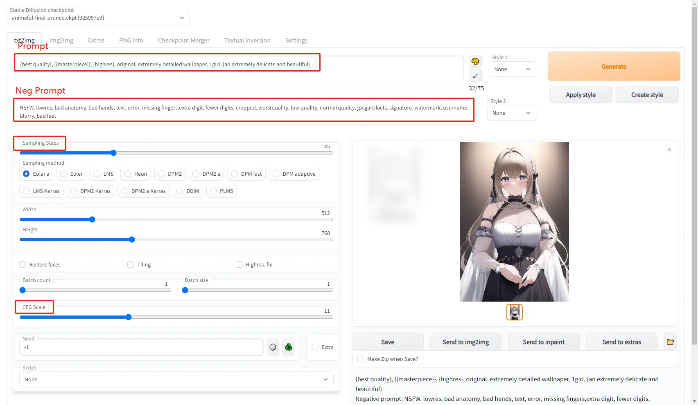

NovelAI的话，设置Stable Diffusion里这里还要设置下：

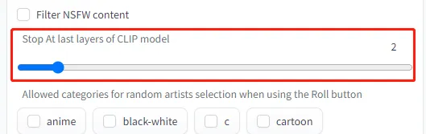

关于这个设置，可以参考[明日香的这个对比](https://github.com/AUTOMATIC1111/stable-diffusion-webui/discussions/2017#discussioncomment-3842186)，设置2-4效果是最佳的：

另外，如果你在公共场合跑，建议增加个 `NSFW` 的负面词，避免因为一些错误的咒语当场社死

> NovelAI的模型可以在[这里下载](https://369369.xyz/host/topic/1082737.html)，WD v1.3的直接[huggingface](https://huggingface.co/hakurei/waifu-diffusion)
>
> 关于搭建可以直接看这篇，不会比整合包难多少：https://github.com/AUTOMATIC1111/stable-diffusion-webui/discussions/2017
> 
> 如果不太熟悉Python环境，B站也有很多整合包可以直接用

### 0.b AUTOMATIC1111的便利功能介绍

授人以鱼不如授人以渔，首先介绍几个调优的小技巧，方便自行调整召回咒文。

#### [Prompt matrix](https://github.com/AUTOMATIC1111/stable-diffusion-webui/wiki/Features#prompt-matrix)

这个功能可以通过脚本，自动对比输入的几组prompt影响。在界面最下面选择 `Script -> Prompt matrix`，然后Prompt里输入 `基础Prompt|第一组|第二组`，就可以生成类似这样的对比矩阵：

这个最常用的是对比局部微调，画风，服装等影响

#### [X/Y plot](https://github.com/AUTOMATIC1111/stable-diffusion-webui/wiki/Features#xy-plot)

另一个`X/Y plot`脚本，则用于实验更多的参数指标。例如CFG Scale的步长，随机数生成器:

甚至[hypernetworks在不同seeds下的影响](https://github.com/AUTOMATIC1111/stable-diffusion-webui/discussions/2017#discussioncomment-3836360)

> masterpiece, best quality, masterpiece, 1girl, solo, outdoors, flowers, dancing
> Negative prompt: nsfw, lowres, bad anatomy, bad hands, text, error, missing fingers, extra digit, fewer digits, cropped, worst quality, low quality, normal quality, jpeg artifacts,signature, watermark, username, blurry, artist name
> Steps: 28, Sampler: Euler, CFG scale: 12, Seed: [SEE COLUMN], Size: 512x512, Model hash: 925997e9, Hypernet: [SEE ROW]

更多进阶用法可以参考[AUTOMATIC1111 - Detailed feature showcase with images](https://github.com/AUTOMATIC1111/stable-diffusion-webui/wiki/Features):，后面用到再进行介绍

# 1. 基础风格

先描述一下要画的内容，例如 `最好的质量，高分辨率，细节满满的壁纸`，按照《参同真解》解释这叫咒语的语音语调^_^ 在这个基础上增加其他内容，成图率会高很多

> Prompt: {best quality}, {{masterpiece}}, {highres}, original, extremely detailed wallpaper
> Neg Prompt: lowres, bad anatomy, bad hands, text, error, missing fingers,extra digit, fewer digits, cropped, worstquality, low quality, normal quality, jpegartifacts, signature, watermark, username, blurry, bad feet

## 1.1 绘制基础

人物的描述最为容易（这也是因为训练集中这类图片最多）。因为WD和NoveAI里，都用到了 [Danbooru2021](https://www.gwern.net/Danbooru2021) 的训练集，因此Danbooru上热门标签，或者训练集的top标签，对最终结果有很大影响。例如单人，一般`girl`/`1girl`，如果想多人可以用 `2girls`，我们添加后可以得到：

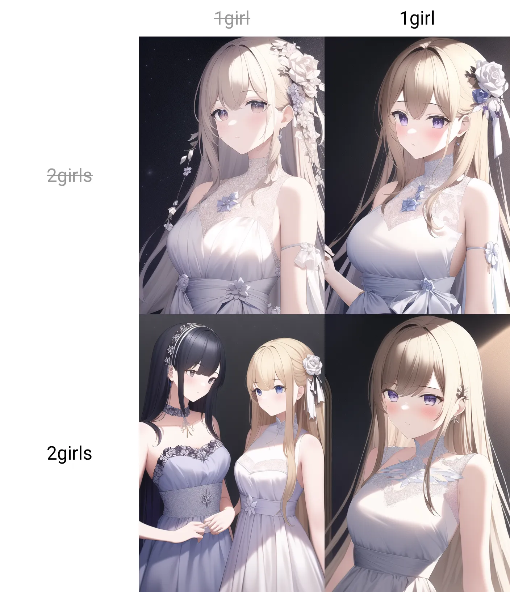

> {best quality}, {{masterpiece}}, {highres}, original, extremely detailed wallpaper, {an extremely delicate and beautiful}**|1girl|2girls**
> Negative prompt: NSFW. lowres, bad anatomy, bad hands, text, error, missing fingers,extra digit, fewer digits, cropped, worstquality, low quality, normal quality, jpegartifacts, signature, watermark, username, blurry, bad feet
> Steps: 45, Sampler: Euler a, CFG scale: 11, Seed: 3448322199, Size: 512x768, Model hash: 925997e9, Clip skip: 2

这种没有任何细节描述的，属于让NovelAI自由发挥。但这个结果有意思的是，同seed不加相反细节最好（这是否说明NovelAI训练时刻意加了权重，对这种画风甚至出现了严重bias）。相比`2girls`，`1girl`的训练数据显然更多，两个都存在时只画了1个人

## 1.2 关于 `{{masterpiece}}` 等魔法词

有一些关键词，可以提升绘制结果的质量。例如 `masterpiece`杰作，添加后可以通过Prompt矩阵结果，看到同Seed下的明显差异：

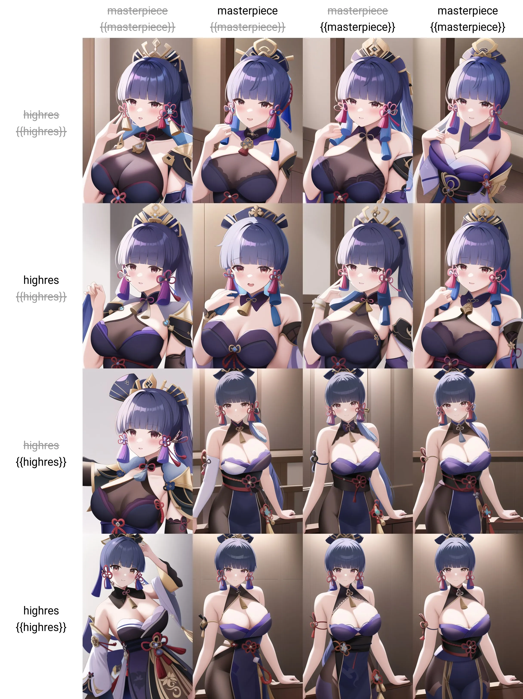

从结果可以看到，`{{masterpiece}}` 强调2次（[语法解释](https://github.com/AUTOMATIC1111/stable-diffusion-webui/wiki/Features#attentionemphasis)）后质量确实有提升（无论五官还是衣服）；而另一个 `highres` 作用有限。当然这个结果也有可能因为seed不同而不稳定，对于影响不那么明显的，具体需要同Prompt多尝试2次才能知道确切的作用

## 1.3 关于背景的处理

背景也是可以调整的，如果想生成干净的可以添加 `black background`，这个强度非常好可以解决大多数背景不协调的问题，方便后面抠图叠加：

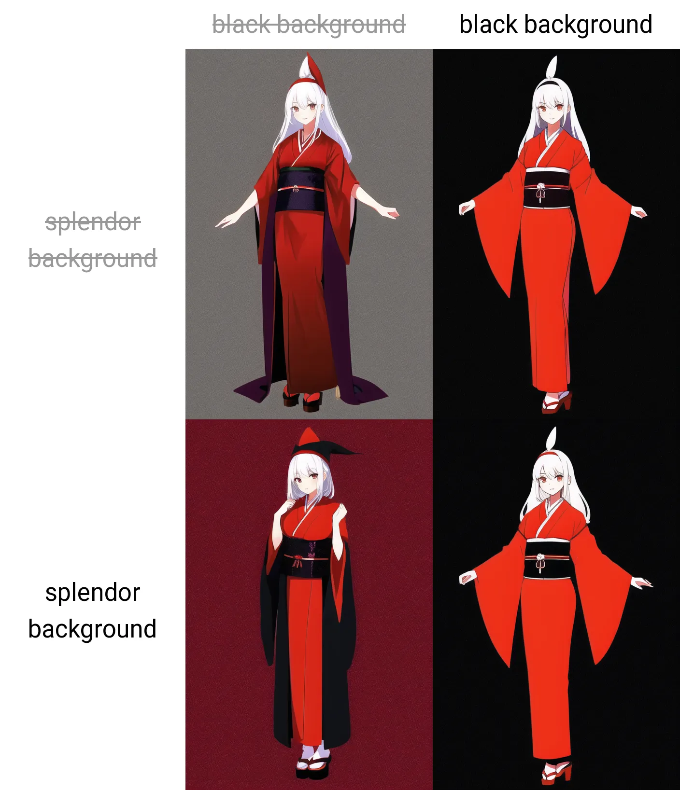

当然也可以用 `nebula background`, `magazine cover` 这样的描述来一次生成背景，一切看个人喜好。不过这样的后果，有时候会带来一些不那么好的结果。

`nebula background`会一定概率让衣服上也出现星云，除非对衣服有非常明确的描述指向，或者就是想要这种风格：

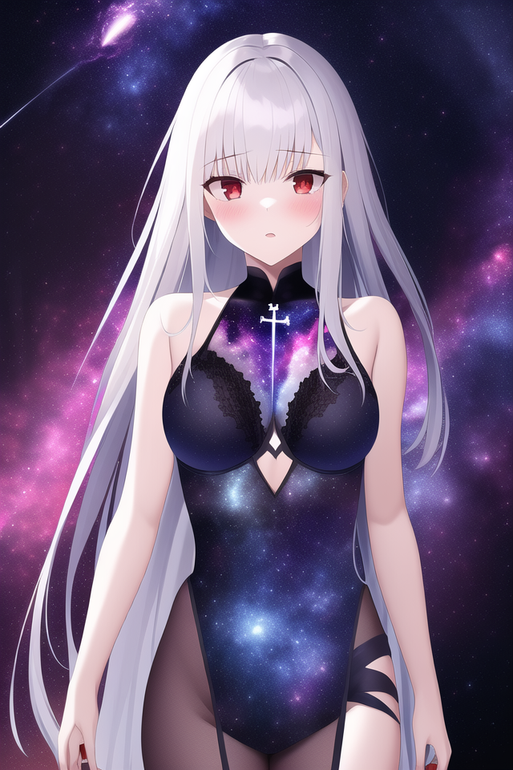

> best quality, highres, original, extremely detailed wallpaper, 1girl, long sliver hair, iron cross, poker face, red eyes, an extremely delicate and beautiful, nebula background, {{masterpiece}}
> Negative prompt: lowres, bad anatomy, bad hands, text, error, missing fingers,extra digit, fewer digits, cropped, worstquality, low quality, normal quality, jpegartifacts, signature, watermark, username, blurry, bad feet
> Steps: 35, Sampler: Euler a, CFG scale: 11, Seed: 3437716200, Size: 640x960, Model hash: 925997e9, Clip skip: 2

`magazine cover`虽然不会让前景出现变化，但杂志的文字很难定制而且基本不知道在说啥：

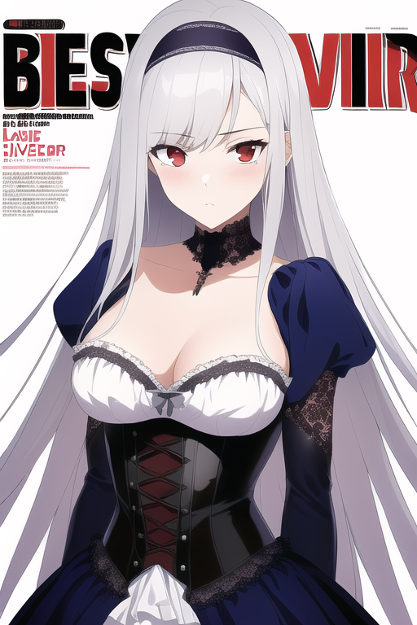

> {best quality}, {{masterpiece}}, {highres}, original, extremely detailed wallpaper, 1girl, long sliver hair, styled headband, court corset, poker face, red eyes, {an extremely delicate and beautiful, official art, magazine cover
> Negative prompt: lowres, bad anatomy, bad hands, text, error, missing fingers,extra digit, fewer digits, cropped, worstquality, low quality, normal quality, jpegartifacts, signature, watermark, username, blurry, bad feet
> Steps: 30, Sampler: Euler a, CFG scale: 11, Seed: 2976024332, Size: 512x768, Model hash: 925997e9, Clip skip: 2

## 1.4 动作与全身照

如果你只用前面提到的基础风格，加人物的描述，会看到人物往往只会是上半身（画幅512x768竖图），这时可以通过增加动作描述`standing|walking|dancing` 中的前2个来修正：

可以看到`standing`组的脚最正常，而`walking`可能因为原本走动的就很难画，AI只能还原出一只脚的样子。而`dancing`有点出乎意料，看起来是可以和其他2个动作混合的

从原理上来说，描述脚和裤子的词语也能生成全身照，待实验

## 1.5 关于画风

### 1.5.1 风格词与铅笔画

首先，在想要具体画风前，需要先意识到什么是风格词，因为过强的风格词会影响最终出图的倾向，导致出现融合的画风。例如虽然强调了多次 `{{{monochrome}}}, {{{gray scale}}}, {{{pencil sketch lines}}}`，但结果并不是铅笔画：

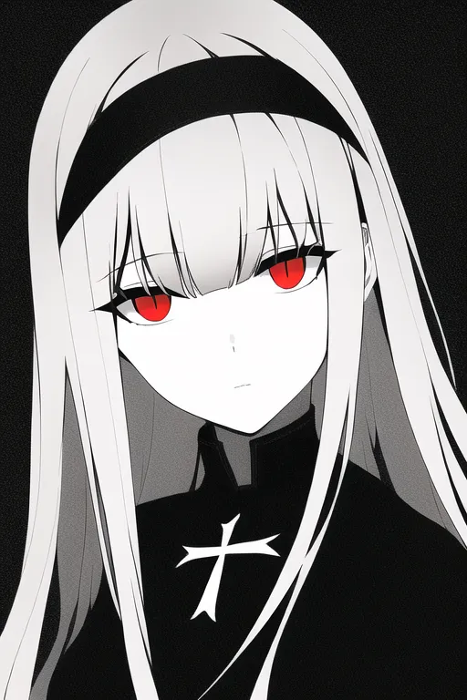

> {best quality}, {highres}, original, extremely detailed wallpaper, 1girl, long sliver hair, styled headband, iron cross, red eyes, {an extremely delicate and beautiful, {{{expressionless}}}, clear face, empty eyes, iron cross, {{{monochrome}}}, {{{gray scale}}}, {{{pencil sketch lines}}}
> Negative prompt: lowres, bad anatomy, bad hands, text, error, missing fingers,extra digit, fewer digits, cropped, worstquality, low quality, normal quality, jpegartifacts, signature, watermark, username, blurry, bad feet,  blush, troubled eyebrow, cheek
> Steps: 35, Sampler: Euler a, CFG scale: 11, Seed: 2599728945, Size: 512x768, Model hash: 925997e9, Clip skip: 2

这里有几个问题，首先是 `{best quality}, {highres}, original, extremely detailed wallpaper`，乃至 `{{masterpiece}}` 这类都有可能造成风格的偏移，因为很少有人用铅笔画去做桌面，而且铅笔画一般缺少细节。去掉这些后对比，就正常很多了：

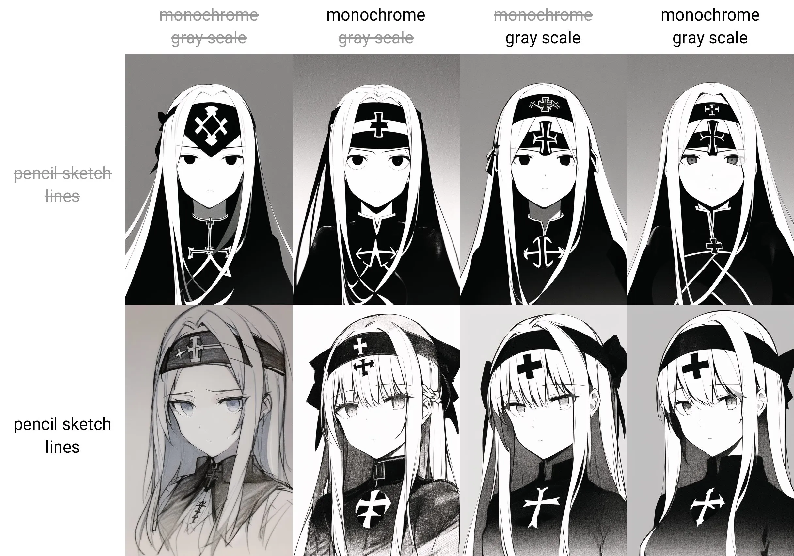

> 1girl, long sliver hair, styled headband, iron cross, {an extremely delicate and beautiful, {{{expressionless}}}, clear face, empty eyes, iron cross|monochrome|gray scale|pencil sketch lines
> Negative prompt: lowres, bad anatomy, bad hands, text, error, missing fingers,extra digit, fewer digits, cropped, worstquality, low quality, normal quality, jpegartifacts, signature, watermark, username, blurry, bad feet,  blush, troubled eyebrow, cheek
> Steps: 35, Sampler: Euler a, CFG scale: 11, Seed: 2599728945.0, Size: 512x768, Model hash: 925997e9, Clip skip: 2

结合自己想要的风格，选取 `monochrome` 和 `{{pencil sketch lines}}`，并强调下倾向。相对应的还有 `watercolor`/`pixel art` 等风格指向，都可以尝试。

还有一些好用的，比如`chibi`Q版；`oil painting`油画；`photo realistic`现实照片（会更清晰？）

画风也会和背景一样，对人物造成影响。例如`makoto shinkai`（新海誠風）虽然能生成漂亮的天空背景，但混用会影响人物的效果。建议实际时参考背景一节，将前景和背景分开生成再拼接：

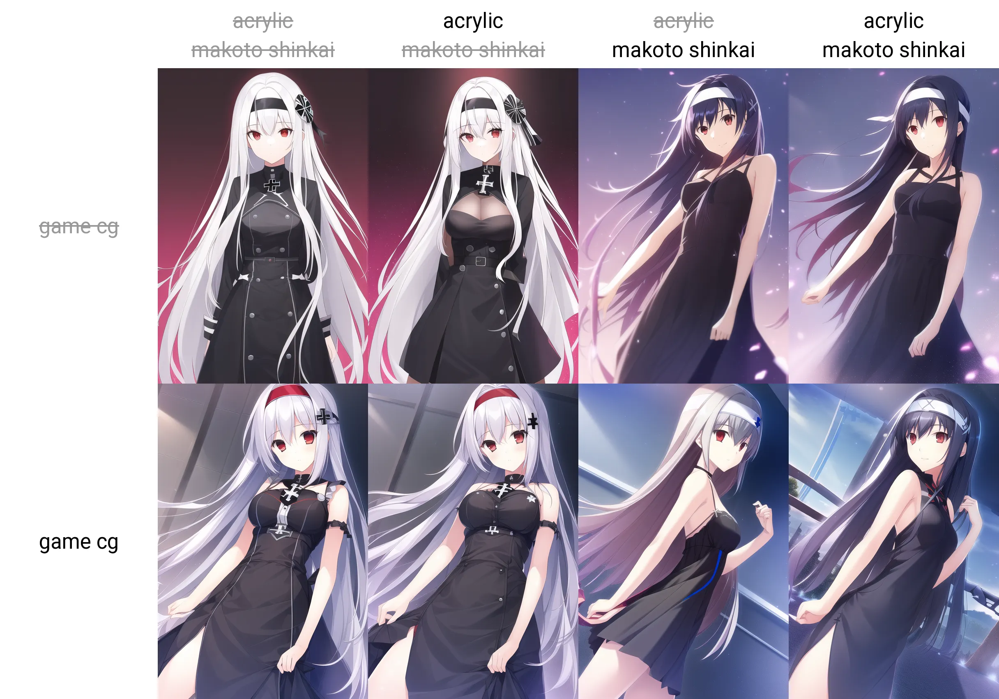

### 1.5.2 画师风格词

还有一类风格词，是直接描述需要的画师名，或者作品的名称。例如`{granblue fantasy}, {official art}`：

> 1girl, long sliver hair, styled headband, red eyes, iron cross, {granblue fantasy}, {official art}
> Negative prompt: lowres, bad anatomy, bad hands, text, error, missing fingers,extra digit, fewer digits, cropped, worstquality, low quality, normal quality, jpegartifacts, signature, watermark, username, blurry, bad feet,  blush, troubled eyebrow, cheek
> Steps: 35, Sampler: Euler a, CFG scale: 9, Seed: 716858732, Size: 512x768, Model hash: 925997e9, Clip skip: 2

一份官方机甲风立绘就有了

（未完待续）