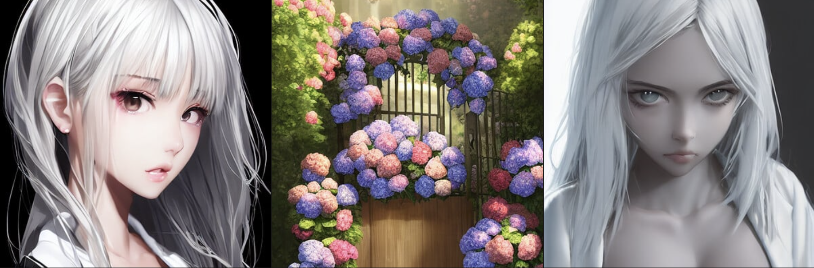

## 前言

> Stable Diffusion确实可玩性很高，十一玩了很久的 Waifu Diffusion，还开了个[ArtStation账号](https://upbit.artstation.com/)记录生成作品的Prompt和Seeds，方便回顾生成得不错的作品。
> 
> 
> 
> 这里记录下一些调整过程中的技巧，方便以后查询
> 
> 不过 [hakurei/waifu-diffusion](https://huggingface.co/hakurei/waifu-diffusion) 更新到v1.3后，感触是同样seed下1.3风格有点过度，而且`full body`描述容易出现没头的情况（v1.2很少遇到）。这两天看到[NovelAI泄漏](https://mirai.mamoe.net/topic/1659/%E6%9C%AC%E5%9C%B0%E6%90%AD%E5%BB%BAnovelai-%E5%85%8D%E8%B4%B9%E7%9A%84%E8%89%B2%E5%9B%BE%E7%94%9F%E6%88%90%E5%99%A8)，又有可以玩的了，后面有新东西再更新

### 参考文献

* 很棒的指引，从这里学到如何强化某个输入，如何调整角度与画幅：[Waifu Diffusion で効率的に画像を生成する](https://dskjal.com/others/waifu-diffusion-workflow.html)
* All In One的WebUI，简单易用。让GFPGAN修正人脸/R-ESRGAN放大相当容易。强烈推荐：[AUTOMATIC1111 WebUI](https://github.com/AUTOMATIC1111/stable-diffusion-webui)
* 一些相关资料介绍：[話題のお絵かき画像生成AI『Stable Diffusion』の体験・インストール方法・プロンプトのコツ・関連情報のまとめ覚書（Win/Mac/Colab）](https://www.activitv.com/entry/stable-diffusion/)

--------------

# 1. 构图调整

# 2. 画风调整
## 2.1 新海誠：[makoto shinkai style](https://lexica.art/?q=makoto+shinkai+style)

# 3. 光照调整

# 4. 其他优化（玄学）
